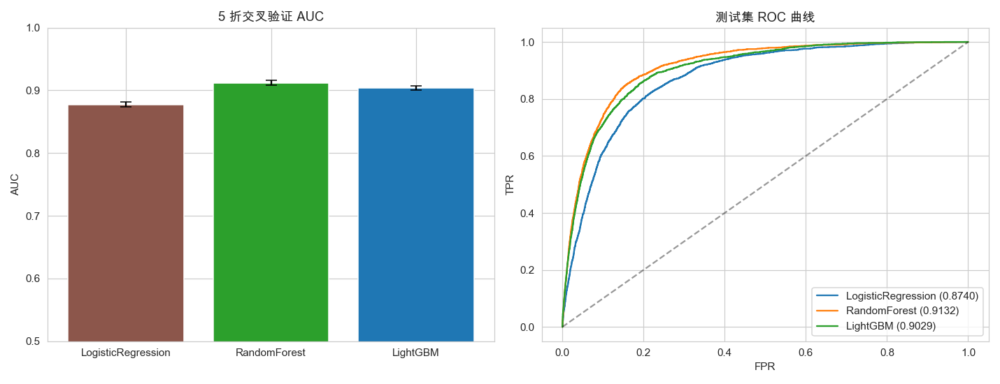

# 5G User Prediction

Predicting whether a telecom user is a **5G user** from billing, traffic, activity,
package and regional features. This is a highly **class-imbalanced binary classification**
problem evaluated with **AUC**.

A course group project (Artificial Intelligence). Implemented and compared three
models: Logistic Regression, Random Forest and LightGBM.

## Task

Given 58 anonymised features (20 categorical `cat_*` and 38 numerical `num_*`) plus
an `id`, predict the binary `target` (1 = 5G user, 0 = non-5G user). The dataset has
**800,000** samples, no missing values, and the positive class makes up only **1.32%**
of them. The key challenges are therefore class imbalance and weak linear signal.

## Approach

All models share an identical stratified 80/20 train/test split and are evaluated with
5-fold cross-validation on the training set.

| Model | Type | Categorical encoding | Imbalance handling |
|-------|------|----------------------|--------------------|
| Logistic Regression | linear baseline | one-hot + standardisation | `class_weight='balanced'` |
| Random Forest | bagging ensemble | ordinal encoding | `class_weight='balanced'` |
| LightGBM | gradient boosting | native categorical | `scale_pos_weight` |

`cat_12` has ~110k unique values and behaves like a high-cardinality continuous
variable, so it is kept as a numeric feature instead of being one-hot encoded.

## Results

| Model | CV AUC | Test AUC | Test AP |
|-------|--------|----------|---------|
| LogisticRegression | 0.8776 | 0.8740 | 0.0874 |
| RandomForest | 0.9122 | 0.9132 | 0.1386 |
| LightGBM | 0.9036 | 0.9029 | 0.1383 |



Both tree-based ensembles clearly outperform the linear baseline. This matches the EDA
finding that feature–target correlations are weak (max |r| ≈ 0.12) and the discriminative
signal is largely **non-linear**. Given the severe imbalance, the PR curve (AP) is more
informative than ROC for the positive class.

## Project Structure

```
.
├── 5g_user_prediction.ipynb      # main notebook: EDA, training, comparison
├── solution.py                   # same pipeline as a runnable script
├── requirements.txt
├── README.md
└── output/
    ├── figures/                  # EDA and result plots
    ├── submission.csv            # best-model predictions (generated, git-ignored)
    └── cv_results.csv            # cross-validation summary (generated, git-ignored)
```

`train.csv` is **not** included — it is large (282 MB) and should be placed in the
project root before running.

## Requirements

- Python 3.10+
- See `requirements.txt`

```bash
pip install -r requirements.txt
```

## Reproducibility

```bash
# place train.csv in the project root, then
python solution.py          # trains all models, writes output/
jupyter notebook 5g_user_prediction.ipynb   # interactive version
```

All randomness is seeded (`random_state=42`), so every figure and result file under
`output/` is fully reproducible.
